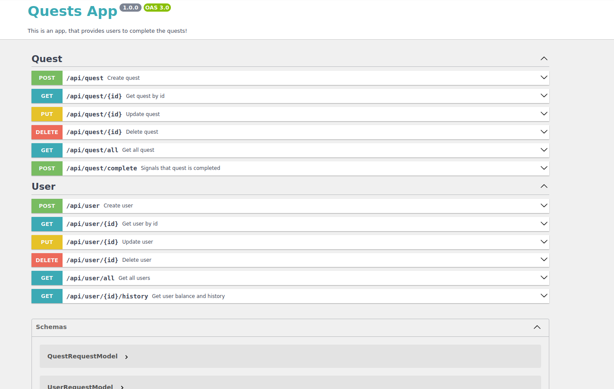

# vk_intership_rest_api

## Requirements

1. Git
2. GNU Make version 4 or higher
3. Docker version 24 or higher (can be replaced by installing docker-compose and changing Makefile)
4. Web Browser (FireFox, for example)

## Installation
1. Clone this repository 
```shell
git clone https://github.com/pvpender/vk_intership_rest_api
```
2. Go to the folder
```shell
cd vk_intership_rest_api
```
3. Run
```shell
make up
```
4. After all dependencies was installed go to the `http://localhost:8081/api/doc` and see the doc, there you can test requests



## Down and clearing
1. If you want to close app, execute:
```shell
make down
```
2. If you want to clear app data:
```shell
make clear
```

## Run without docker

If you want to run app, without docker:
1. Make sure, what you have PostgreSQL server with several tables, which you can find at `docker/postgres/conf`
2. Change `.env` data with your server data, also change `url` in `config/packages/doctrine.yaml` if you have any troubles
3. Run `composer update`
4. Run `symfony server:start`
5. Go to the `http://localhost:8000/api/doc`